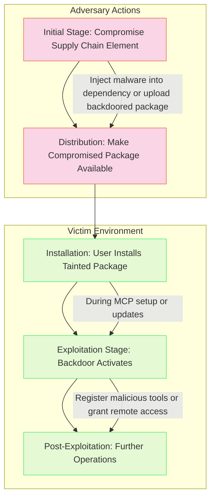

# SAFE-T1002: Supply Chain Compromise

## Overview
**Tactic**: Initial Access (ATK-TA0001)  
**Technique ID**: SAFE-T1002  
**Severity**: Critical  
**First Observed**: March 2024 (Discovered via namesquatting attacks on Hugging Face AI model repositories)  
**Last Updated**: 2025-07-19

## Description
Supply Chain Compromise is a technique where adversaries tamper with MCP server packages, dependencies, or build processes to distribute backdoored or malicious versions through legitimate channels. This exploits the trust users place in package repositories and supply chains, enabling initial access when compromised components are installed and executed in MCP environments.

Adversaries leverage differences in build environments, repository access controls, and dependency resolution to inject malicious code. For instance, they may compromise upstream libraries used by MCP implementations or use namesquatting to mimic popular MCP tool names, leading to unintended installation of backdoored servers that expose hidden capabilities to attackers.

## Attack Vectors
- **Primary Vector**: Distribution of backdoored MCP packages through compromised repositories like PyPI or npm
- **Secondary Vectors**: 
  - Namesquatting/typosquatting on MCP-related package names
  - Compromise of build pipelines or CI/CD systems for legitimate MCP projects
  - Injection into third-party dependencies integrated with MCP servers
  - **Malicious Updates**: Pushing tainted updates to existing packages via compromised maintainer accounts

## Technical Details

### Prerequisites
- Access to package repositories, build systems, or maintainer credentials
- Knowledge of MCP package ecosystem and dependency graphs

### Attack Flow



1. **Initial Stage**: Adversary compromises a supply chain element, such as injecting malware into a dependency or uploading a backdoored package
2. **Distribution**: Compromised package is made available through official or mirrored repositories
3. **Installation**: Users install the tainted package during MCP setup or updates
4. **Exploitation Stage**: Backdoor activates, registering malicious tools or granting remote access
5. **Post-Exploitation**: Attacker uses the foothold for further operations, such as data exfiltration

### Example Scenario
```json
// Example of a backdoored MCP package manifest (simplified)
{
  "name": "mcp-server-legit",  // Namesquatted to mimic legitimate package
  "version": "1.2.3",
  "description": "Standard MCP server implementation",
  "dependencies": {
    "backdoor-lib": "^0.1.0"  // Injected malicious dependency
  },
  "scripts": {
    "postinstall": "node backdoor.js"  // Executes backdoor on install
  }
}
```

### Proof of Concept Examples
We provide examples to demonstrate and detect this technique:

1. **[Backdoored MCP Package PoC](examples/backdoored-package.py)**: Demonstrates namesquatting and dependency injection methods, including post-install scripts and hidden backdoors
2. **[Supply Chain Detector](examples/supply-chain-detector.py)**: Scans dependencies for known malicious indicators; usage: python examples/supply-chain-detector.py [package.json]

```python
# Example PoC snippet for detecting suspicious dependencies
import json

def detect_backdoor(manifest):
    if 'postinstall' in manifest.get('scripts', {}):
        print("Warning: Post-install script detected - potential backdoor")
    for dep in manifest.get('dependencies', {}):
        if 'backdoor' in dep.lower():
            print(f"Malicious dependency detected: {dep}")

with open('package.json') as f:
    manifest = json.load(f)
    detect_backdoor(manifest)
```

### Advanced Attack Techniques (2024-2025 Research)

#### Namesquatting and Typosquatting (2024 Research)
According to research from Protect AI and others, attackers exploit package naming conventions:

1. **Variation 1**: Creating packages with similar names to popular MCP tools (e.g., "mcp-serve" vs. "mcp-server") to deliver malware ([Unveiling AI/ML Supply Chain Attacks - Protect AI, 2024](https://protectai.com/threat-research/unveiling-ai-supply-chain-attacks-on-hugging-face))
2. **Variation 2**: Injecting into AI model repositories like Hugging Face for downstream compromise ([Malice In Chains - Bonner & Janus, 2024](https://www.youtube.com/watch?v=1moD2zoAyaU))

#### MCP-Specific Supply Chain Evolution (2025)
##### Dynamic Dependency Injection
Attackers compromise MCP build processes to insert runtime dependencies ([MCP Security 101 - Protect AI, 2025](https://protectai.com/blog/mcp-security-101))

##### Compromised Update Channels
Exploiting auto-update mechanisms in MCP tools to deliver backdoored versions post-installation ([The 2025 Software Supply Chain Security Report, 2025](https://ntsc.org/wp-content/uploads/2025/03/The-2025-Software-Supply-Chain-Security-Report-RL-compressed.pdf))

## Impact Assessment
- **Confidentiality**: High - Backdoors enable data leakage from MCP environments
- **Integrity**: High - Tampered code alters MCP behavior and tool executions
- **Availability**: Medium - Compromised packages may cause crashes or DoS
- **Scope**: Network-wide - Affects all systems installing the tainted package

### Current Status (2025)
According to security researchers, organizations are beginning to implement mitigations aligned with established frameworks like SLSA and NIST SP 800-204D:
- Adoption of SLSA Level 2+ practices, including tamper-proof builds and provenance generation for MCP packages ([SLSA Framework, 2023](https://slsa.dev/))
- Integration of NIST SP 800-204D strategies, such as secure build isolation and automated security scanning in CI/CD pipelines ([NIST SP 800-204D, 2024](https://nvlpubs.nist.gov/nistpubs/SpecialPublications/NIST.SP.800-204D.pdf))
- Tools like MCP-Scan now include supply chain checks ([Invariant Labs, 2025](https://invariantlabs.ai/blog/introducing-mcp-scan))

However, new vectors like AI-specific dependency graphs continue to emerge, as seen in the mcp-remote vulnerability exploitation patterns.

## Detection Methods

### Indicators of Compromise (IoCs)
- Unexpected post-install scripts or dependencies in MCP packages
- Package names with subtle variations from known legitimate ones
- Anomalous network connections from installed MCP servers
- Discrepancies in package hashes or provenance compared to official sources

### Detection Rules

**Important**: Rules are examples only. Attackers evolve techniques; organizations should:
- Use AI-based anomaly detection for novel patterns
- Update rules via threat intelligence
- Layer detections (e.g., pattern + semantic analysis)
- Consider dependency graph analysis for MCP ecosystems

#### AI-Based Anomaly Detection Examples
```yaml
# Example: Dependency anomaly detection
- name: dependency_anomaly
  type: ai_analysis
  model: supply-chain-bert
  indicators:
    - "Unusual dependency names or versions"
    - "Presence of post-install scripts in non-build packages"

# Example: Behavioral analysis
- name: install_behavior
  type: statistical_analysis
  baseline_window: 7_days
  indicators:
    - "Unexpected network activity post-install"
    - "Anomalous file modifications during package setup"
```

```yaml
# EXAMPLE SIGMA RULE - Not comprehensive
title: Suspicious MCP Package Installation
id: eeceebd8-0ec4-4543-a432-c9596d67da1c
status: experimental
description: Detects potential supply chain compromise through suspicious package behaviors
author: SAFE-MCP Team
date: 2025-07-15
references:
  - https://github.com/safe-mcp/techniques/SAFE-T1002
logsource:
  product: mcp
  service: package_manager
detection:
  selection:
    event_category: install
    package_name:
      - '*mcp*'
      - '*llm*'
    indicators:
      - 'postinstall_script: true'
      - 'dependency_count > 10'  # Unusual number of deps
      - 'network_outbound: true'  # Immediate outbound connection
  condition: selection
falsepositives:
  - Legitimate packages with post-install requirements
  - Build tools with network dependencies
level: high
tags:
  - attack.initial_access
  - attack.t1195
  - safe.t1002
```

### Behavioral Indicators
- Unexpected outbound connections after MCP package installation
- Changes in MCP tool lists post-update without user intervention
- Anomalous resource usage from newly installed components

### Detection Enhancements

1. **Behavioral baselines per package manager**: Different package managers (Yarn Berry, Poetry, PDM) have distinct lock-file semantics. Flag installations that bypass lock enforcement or exhibit unusual resolution patterns for each package manager type.

2. **Runtime egress scoring**: Immediately after package installation, monitor and score outbound traffic. Flag connections to low-reputation IPs that exceed X standard deviations from the baseline egress pattern for similar packages.

3. **SBOM delta diff**: Compare the signed SBOM generated at build-time against the runtime SBOM using CycloneDX 1.6 with evidence extensions. This can detect unexpected artifacts or modifications that occurred between build and deployment.

## Mitigation Strategies

### Preventive Controls
1. **[SAFE-M-6: Tool Registry Verification](../../mitigations/SAFE-M-6/README.md)**: Verify package sources and signatures before installation, aligning with SLSA Level 1 requirements for build provenance and NIST SP 800-204D guidance on automated verification of artifacts in CI/CD pipelines
2. **[SAFE-M-2: Cryptographic Integrity](../../mitigations/SAFE-M-2/README.md)**: Use hashed and signed packages for MCP components, incorporating SLSA Level 2 practices for tamper-proof builds and NIST recommendations for digital signatures and attestations to ensure artifact integrity
3. **[SAFE-M-9: Sandboxed Testing](../../mitigations/SAFE-M-9/README.md)**: Test new packages in isolated environments, following NIST SP 800-204D strategies for secure, isolated build platforms and SLSA guidelines for hardened build environments
4. **[SAFE-M-4: Unicode Sanitization](../../mitigations/SAFE-M-4/README.md)**: Filter for hidden characters in package metadata
5. **[SAFE-M-24: SBOM Generation and Verification](../../mitigations/SAFE-M-24/README.md)**: Generate and verify Software Bill of Materials (SBOM) for all MCP components to track dependencies and provenance, enabling detection of tampered elements ; Effectiveness: High - Provides transparency into supply chain components, justified by NIST's emphasis on documenting unknown provenance to mitigate hidden risks.
6. **[SAFE-M-25: AI-Specific Risk Modeling](../../mitigations/SAFE-M-25/README.md)**: Incorporate AI/ML-specific threats like data poisoning and model theft into supply chain risk assessments, with periodic updates and human-in-the-loop reviews ; Effectiveness: Medium-High - Enables proactive identification of AI-unique vulnerabilities in the supply chain, as per NIST's adversarial ML taxonomy.
7. **[SAFE-M-26: Data Provenance Tracking](../../mitigations/SAFE-M-26/README.md)**: Track and verify the provenance of training data, models, and dependencies used in MCP tools, applying anomaly detection for tampering ; Effectiveness: High - Prevents poisoning attacks by ensuring data integrity, supported by NIST's recommendations for including adversarial samples in testing.

### Detective Controls
1. **[SAFE-M-10: Automated Scanning](../../mitigations/SAFE-M-10/README.md)**: Regularly scan dependencies and artifacts for vulnerabilities using automated tools in CI/CD pipelines
2. **[SAFE-M-11: Behavioral Monitoring](../../mitigations/SAFE-M-11/README.md)**: Monitor for anomalies in installation and runtime behavior, including resource usage and network activity
3. **[SAFE-M-12: Audit Logging](../../mitigations/SAFE-M-12/README.md)**: Log all package installations, updates, and changes with provenance details

### Security Tool Integration
[MCP-Scan]: Includes supply chain verification ([Invariant Labs](https://invariantlabs.ai/blog/introducing-mcp-scan))

```bash
# Example usage
mcp-scan scan --supply-chain
```

```bash
# CI/CD integration
if mcp-scan scan --json | jq '.supply_chain_risks > 0'; then
    echo "Supply chain risks detected!"
    exit 1
fi
```

### Response Procedures
1. **Immediate Actions**:
   - Quarantine affected systems
   - Revoke any exposed credentials
2. **Investigation Steps**:
   - Analyze package provenance
   - Trace dependency graphs
3. **Remediation**:
   - Remove compromised packages
   - Update to verified versions

## Real-World Incidents (2024-2025)

### Hugging Face Namesquatting Attack (March 2024)
[Protect AI Research](https://protectai.com/threat-research/unveiling-ai-supply-chain-attacks-on-hugging-face): Attackers uploaded malicious models under similar names, leading to backdoor execution in AI pipelines. Impact: Code execution on user systems.

### mcp-remote Package Vulnerability (July 2025)
[JFrog Disclosure](https://jfrog.com/blog/2025-6514-critical-mcp-remote-rce-vulnerability/): Critical RCE vulnerability (CVE-2025-6514, CVSS 9.6) disclosed July 9, 2025. When mcp-remote connects to untrusted servers, it enables OS command injection. While primarily a software vulnerability, malicious packages could exploit this by forcing connections to attacker-controlled servers. Affected 437,000+ downloads before fix in v0.1.16.

## Sub-Techniques

### SAFE-T1002.001: Namesquatting/Typosquatting
Focus on mimicking package names to trick installations, common in AI ecosystems like PyPI and Hugging Face.

### SAFE-T1002.002: Dependency Injection
Tampering with upstream libraries to propagate malice through dependency trees.

## Related Techniques
- [SAFE-T1001](../SAFE-T1001/README.md): Tool Poisoning Attack - Often combined with supply chain distribution
- [SAFE-T1003](../SAFE-T1003/README.md): Malicious MCP-Server Distribution - Direct extension of supply chain tactics

## References
- [Model Context Protocol Specification](https://modelcontextprotocol.io/specification)
- [OWASP Top 10 for LLM Applications](https://owasp.org/www-project-top-10-for-large-language-model-applications/)
- [Unveiling AI/ML Supply Chain Attacks - Protect AI, 2024](https://protectai.com/threat-research/unveiling-ai-supply-chain-attacks-on-hugging-face)
- [The 2025 Software Supply Chain Security Report, 2025](https://ntsc.org/wp-content/uploads/2025/03/The-2025-Software-Supply-Chain-Security-Report-RL-compressed.pdf)
- [MCP Security 101 - Protect AI, 2025](https://protectai.com/blog/mcp-security-101)
- [Critical mcp-remote Flaw - JFrog, 2025](https://jfrog.com/blog/2025-6514-critical-mcp-remote-rce-vulnerability/)
- [Adversarial Machine Learning Taxonomy - NIST, 2025](https://nvlpubs.nist.gov/nistpubs/ai/NIST.AI.100-2e2025.pdf)
- [SLSA Framework - Supply-chain Levels for Software Artifacts](https://slsa.dev/)
- [NIST SP 800-204D: Strategies for the Integration of Software Supply Chain Security in DevSecOps CI/CD Pipelines, 2024](https://nvlpubs.nist.gov/nistpubs/SpecialPublications/NIST.SP.800-204D.pdf)

## MITRE ATT&CK Mapping
- [T1195 - Supply Chain Compromise](https://attack.mitre.org/techniques/T1195/)

## Version History
| Version | Date | Changes | Author |
|---------|------|---------|--------|
| 1.0 | 2025-07-15 | Initial documentation | Frederick Kautz |
| 1.1 | 2025-07-15 | Incorporated SLSA and NIST SP 800-204D guidance into mitigations and current status | Frederick Kautz |

## Contributing
Submit updates, new incidents, or mitigations via GitHub issues/PRs at [fkautz/safe-mcp]. Ensure claims are verified with sources.