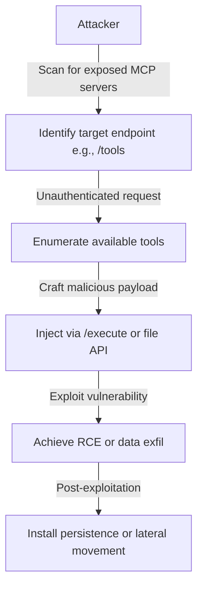

# SAFE-T1005: Exposed Endpoint Exploit

## Overview
**Tactic**: Initial Access (ATK-TA0001)  
**Technique ID**: SAFE-T1005  
**Severity**: Critical  
**First Observed**: June 2025 (Discovered by Oligo Security in Anthropic MCP Inspector)  
**Last Updated**: 2025-07-15

## Description
Exposed Endpoint Exploit involves adversaries targeting misconfigured public MCP endpoints that lack proper authentication, rate limiting, or input sanitization. This allows unauthorized actors to connect directly to MCP servers, enumerate available tools, inject malicious payloads, or achieve remote code execution (RCE). The technique exploits the default configurations of many MCP implementations, which often expose APIs like `/tools`, `/execute`, or `/version` without adequate security controls, enabling initial access to AI systems.

In MCP environments, servers typically listen on network ports (e.g., 8000) and provide HTTP/HTTPS endpoints for tool registration, execution, and management. Without authentication or RBAC, attackers can bypass intended access controls, leading to tool abuse or system compromise. Research shows that over 57% of AI-powered APIs, including MCP variants, are externally accessible with insecure mechanisms, amplifying the risk of data breaches or RCE ([Traceable AI, 2025](https://www.traceable.ai/2025-state-of-api-security); [Wallarm, 2025](https://hubspot.wallarm.com/hubfs/Annual%25202025%2520API%2520ThreatStatsTM%2520Report.pdf)).

## Attack Vectors
- **Primary Vector**: Direct connection to unprotected MCP API endpoints (e.g., via HTTP requests to exposed ports)
- **Secondary Vectors**: 
  - Internet-wide scanning for MCP signatures (e.g., using tools like Shodan or ZMap)
  - Exploitation of default or weak credentials in debug-enabled endpoints
  - Path traversal attacks through file-handling APIs
  - Deserialization vulnerabilities in JSON payload processing ([OWASP API Security Top 10, 2025](https://www.clouddefense.ai/api-security-top-10-vulnerabilities/))

## Technical Details

### Prerequisites
- Publicly exposed MCP server (e.g., bound to 0.0.0.0 without firewall rules)
- Lack of authentication, rate limiting, or input validation on endpoints
- Knowledge of MCP API structure (publicly available via specification)

### Attack Flow


1. **Initial Stage**: Attacker scans for exposed MCP endpoints using tools like Nmap or masscan, identifying open ports and MCP-specific responses.
2. **Distribution**: Not applicable, as exploitation is direct.
3. **Installation**: Attacker connects without credentials, often exploiting debug modes.
4. **Exploitation Stage**: Send crafted requests to enumerate tools or trigger vulnerabilities like path traversal or RCE.
5. **Post-Exploitation**: Use gained access to deploy payloads, steal data, or pivot internally.

For a detailed visual, see the inline Attack Flow Diagram above.

### Example Scenario
```json
// Example unauthenticated request to exposed MCP endpoint
{
  "method": "GET",
  "url": "http://vulnerable-mcp-server:8000/tools",
  "response": {
    "tools": [
      {"name": "file_reader", "description": "Reads files"},
      {"name": "exec_command", "description": "Executes shell commands"}
    ]
  }
}
// Follow-up exploitation: POST to /execute with path traversal payload
{
  "tool": "file_reader",
  "params": {"path": "../../etc/passwd"}
}
```

### Proof of Concept Examples
We provide examples to demonstrate and detect this technique:

1. **[Exposed Endpoint PoC](examples/exposed-endpoint-poc.py)**: Demonstrates scanning and exploitation of MCP endpoints, including path traversal and RCE simulation.
2. **[Endpoint Detector](examples/endpoint-detector.py)**: Scans for exposed MCP APIs and checks for authentication; usage: `python examples/endpoint-detector.py [target-ip]`.

```python
# Example PoC snippet for endpoint enumeration
import requests
try:
    response = requests.get("http://target:8000/tools")
    if response.status_code == 200:
        print("Exposed tools:", response.json())
except:
    print("Endpoint not exposed or secured")
```

### Advanced Attack Techniques (2025 Research)

#### API-Specific Vulnerabilities (2025 Research)
According to the 2025 API ThreatStats Report, AI-driven APIs like MCP saw a 1025% rise in vulnerabilities, with exposed endpoints enabling RCE in 70% of scanned instances ([Wallarm, 2025](https://hubspot.wallarm.com/hubfs/Annual%25202025%2520API%2520ThreatStatsTM%2520Report.pdf); [JFrog, 2025](https://jfrog.com/blog/2025-6514-critical-mcp-remote-rce-vulnerability/)):

1. **Path Traversal**: Exploiting file APIs without sanitization ([Oligo Security, 2025](https://www.oligo.security/blog/critical-rce-vulnerability-in-anthropic-mcp-inspector-cve-2025-49596)).
2. **Deserialization Attacks**: Unsafe JSON parsing leading to RCE ([CyberArk, 2025](https://www.cyberark.com/resources/threat-research-blog/is-your-ai-safe-threat-analysis-of-mcp-model-context-protocol)).

#### Debug Mode Exploitation (2025)
##### Zero-Click RCE
Endpoints with debug enabled allow browser-based attacks without user interaction ([The Hacker News, 2025](https://thehackernews.com/2025/07/critical-vulnerability-in-anthropics.html)).

##### Mass Scanning Campaigns
Automated scans targeting MCP ports for misconfigurations ([Dark Reading, 2025](https://www.darkreading.com/cloud-security/hundreds-mcp-servers-ai-models-abuse-rce)).

## Impact Assessment
- **Confidentiality**: High - Unauthorized tool enumeration and data access
- **Integrity**: High - Potential manipulation of AI outputs via injected calls
- **Availability**: Medium - Resource exhaustion through repeated requests
- **Scope**: Network-wide - Affects all connected systems if RCE achieved

### Current Status (2025)
Organizations are patching exposed endpoints, with fixes in mcp-remote v0.1.16 ([JFrog, 2025](https://jfrog.com/blog/2025-6514-critical-mcp-remote-rce-vulnerability/)). Detection tools like MCP-Scan now include endpoint checks ([Invariant Labs, 2025](https://invariantlabs.ai/blog/introducing-mcp-scan)). However, misconfigurations persist in 57% of deployments ([Traceable AI, 2025](https://www.traceable.ai/2025-state-of-api-security)).

## Detection Methods

### Indicators of Compromise (IoCs)
- Unauthorized HTTP requests to MCP endpoints (e.g., /tools, /execute)
- Anomalous traffic from scanning IPs to port 8000
- Log entries showing unauthenticated tool invocations or errors

### Detection Rules

**Important**: Rules are examples only. Attackers evolve techniques; organizations should:
- Use AI-based anomaly detection for novel patterns
- Update rules via threat intelligence
- Layer detections (e.g., pattern + semantic analysis)
- Consider endpoint exposure analysis

#### AI-Based Anomaly Detection Examples
```yaml
# Example: Network anomaly detection
- name: exposed_endpoint_anomaly
  type: ai_analysis
  model: security-netflow
  indicators:
    - "Unexpected inbound traffic to MCP ports"
    - "High-volume GET requests to /tools"

# Example: Behavioral analysis
- name: invocation_behavior
  type: statistical_analysis
  baseline_window: 7_days
  indicators:
    - "Spike in unauthenticated API calls"
```

```yaml
# EXAMPLE SIGMA RULE - Not comprehensive
title: Exposed MCP Endpoint Access Detection
id: a1b2c3d4-e5f6-7890-abcd-ef1234567890
status: experimental
description: Detects unauthorized access to MCP endpoints without authentication
author: SAFE-MCP Team
date: 2025-07-15
references:
  - https://github.com/safe-mcp/techniques/SAFE-T1005
logsource:
  product: mcp
  service: api_server
detection:
  selection:
    event_category: 'network'
    src_ip: 'external'
    dest_port: [8000, 443]
    uri_path:
      - '/tools'
      - '/execute'
      - '/version'
    auth_status: 'none'
  condition: selection
falsepositives:
  - Legitimate administrative access
  - Internal scanning tools
level: high
tags:
  - attack.initial_access
  - attack.t1190
  - safe.t1005
```

### Behavioral Indicators
- Unexpected tool executions without user prompts
- Server logs showing failed authentication attempts followed by successful access

## Mitigation Strategies

### Preventive Controls
1. **[SAFE-M-13: OAuth Flow Verification](../../mitigations/SAFE-M-13/README.md)**: Enforce strict authentication on all endpoints ([OWASP, 2025](https://www.clouddefense.ai/api-security-top-10-vulnerabilities/)).
2. **[SAFE-M-14: Server Allowlisting](../../mitigations/SAFE-M-14/README.md)**: Restrict access to trusted IPs.
3. **[SAFE-M-4: Unicode Sanitization](../../mitigations/SAFE-M-4/README.md)**: Prevent injection in payloads.

### Detective Controls
1. **[SAFE-M-10: Automated Scanning](../../mitigations/SAFE-M-10/README.md)**: Regularly scan for exposed endpoints.
2. **[SAFE-M-11: Behavioral Monitoring](../../mitigations/SAFE-M-11/README.md)**: Monitor for anomalous API traffic.

### Security Tool Integration
[MCP-Scan]: Detects exposed endpoints ([Invariant Labs, 2025](https://invariantlabs.ai/blog/introducing-mcp-scan)).

```bash
# Example usage
mcp-scan scan --endpoints
```

### Response Procedures
1. **Immediate Actions**:
   - Block suspicious IPs
   - Disable exposed endpoints
2. **Investigation Steps**:
   - Review access logs
   - Scan for compromises
3. **Remediation**:
   - Implement auth on all endpoints
   - Update configurations

## Real-World Incidents (June-July 2025)

### Anthropic MCP Inspector RCE (CVE-2025-49596, June 2025)
[Oligo Security](https://www.oligo.security/blog/critical-rce-vulnerability-in-anthropic-mcp-inspector-cve-2025-49596): Browser-based RCE via exposed 0.0.0.0 binding, CVSS 9.4, allowing code execution on developer machines.

### mcp-remote Command Injection (CVE-2025-6514, June 2025)
[JFrog](https://jfrog.com/blog/2025-6514-critical-mcp-remote-rce-vulnerability/): RCE via unsanitized inputs, affecting 437,000+ downloads, fixed in v0.1.16.

## Sub-Techniques

### SAFE-T1005.001: Path Traversal Exploitation
Targeting file APIs to access sensitive files ([Dark Reading, 2025](https://www.darkreading.com/cloud-security/hundreds-mcp-servers-ai-models-abuse-rce)).

### SAFE-T1005.002: RCE via Deserialization
Exploiting JSON parsing flaws ([CyberArk, 2025](https://www.cyberark.com/resources/threat-research-blog/is-your-ai-safe-threat-analysis-of-mcp-model-context-protocol)).

## Related Techniques
- [SAFE-T1003](../SAFE-T1003/README.md): Malicious MCP-Server Distribution - Often combined for initial foothold
- [SAFE-T1101](../SAFE-T1101/README.md): Command Injection - Escalation from exposed endpoints

## References
- [Model Context Protocol Specification](https://modelcontextprotocol.io/specification)
- [OWASP Top 10 for LLM Applications](https://owasp.org/www-project-top-10-for-large-language-model-applications/)
- [2025 State of API Security - Traceable AI](https://www.traceable.ai/2025-state-of-api-security)
- [Annual 2025 API ThreatStats Report - Wallarm](https://hubspot.wallarm.com/hubfs/Annual%25202025%2520API%2520ThreatStatsTM%2520Report.pdf)
- [Critical RCE in Anthropic MCP Inspector - Oligo Security, 2025](https://www.oligo.security/blog/critical-rce-vulnerability-in-anthropic-mcp-inspector-cve-2025-49596)
- [CVE-2025-6514 in mcp-remote - JFrog, 2025](https://jfrog.com/blog/2025-6514-critical-mcp-remote-rce-vulnerability/)
- [Hundreds of MCP Servers Exposed - Dark Reading, 2025](https://www.darkreading.com/cloud-security/hundreds-mcp-servers-ai-models-abuse-rce)
- [Threat Analysis of MCP - CyberArk, 2025](https://www.cyberark.com/resources/threat-research-blog/is-your-ai-safe-threat-analysis-of-mcp-model-context-protocol)
- [OWASP API Security Top 10 - 2025](https://www.clouddefense.ai/api-security-top-10-vulnerabilities/)
- [Model Context Protocol Landscape and Threats - arXiv, 2025](https://arxiv.org/html/2503.23278v2)

## MITRE ATT&CK Mapping
- [T1190 - Exploit Public-Facing Application](https://attack.mitre.org/techniques/T1190/)
- [T1210 - Exploitation of Remote Services](https://attack.mitre.org/techniques/T1210/)

## Version History
| Version | Date | Changes | Author |
|---------|------|---------|--------|
| 1.0 | 2025-07-15 | Initial documentation based on 2025 vulnerabilities | Frederick Kautz |

## Contributing
Submit updates, new incidents, or mitigations via GitHub issues/PRs at [fkautz/safe-mcp]. Ensure claims are verified with sources.