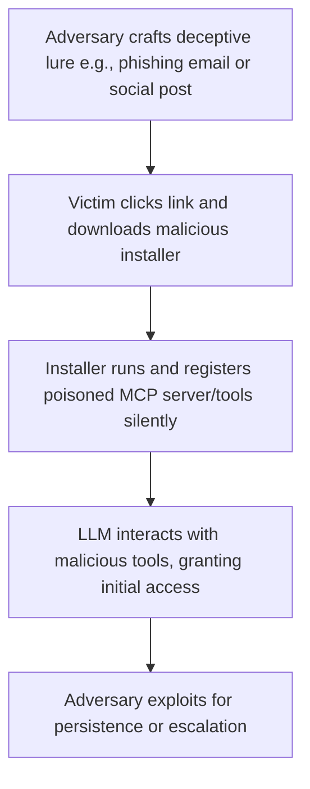

# SAFE-T1006: Social Engineering Induced Tool Installation (SETI)

## Overview
**Tactic**: Initial Access (ATK-TA0001)  
**Technique ID**: SAFE-T1006  
**Severity**: High  
**First Observed**: March 2025 (Discovered by Cisco Talos, [Cisco Talos Report on AI Tool Installer Threats](https://blog.talosintelligence.com/ai-tool-installer-malware/))  
**Last Updated**: 2025-07-15

## Description
Social Engineering Induced Tool Installation (SETI) is an attack technique where adversaries use phishing, deceptive social media campaigns, or other manipulation tactics to convince developers and users to install malicious MCP servers or tools. This exploits human trust in "innovative" or "helpful" AI enhancements, leading to the silent registration of dangerous capabilities within the victim's environment. Once installed, these tools can provide initial access for further exploitation, such as data exfiltration or privilege escalation.

Adversaries leverage differences in user vigilance, often targeting overworked developers with promises of productivity boosts via AI tools. By mimicking legitimate MCP-compatible packages or servers, attackers bypass technical safeguards, relying on psychological manipulation. This technique has evolved with generative AI, enabling highly personalized and convincing lures that reference real MCP documentation or popular AI frameworks.

## Attack Vectors
- **Primary Vector**: Phishing emails and social media posts (e.g., LinkedIn, Twitter) promoting "must-try" MCP tools with links to malicious installers
- **Secondary Vectors**: 
  - Compromised developer forums or Stack Overflow answers suggesting malicious tool installations
  - Fake tutorials and blog posts on sites mimicking legitimate AI resources
  - Malicious advertisements on tech platforms targeting AI/ML keywords
  - **AI-Generated Personalized Lures**: Using LLMs to craft tailored messages based on victim's public GitHub activity ([IBM X-Force 2025 Threat Intelligence Index](https://www.ibm.com/thought-leadership/institute-business-value/en-us/report/2025-threat-intelligence-index))

## Technical Details

### Prerequisites
- Access to social engineering channels (e.g., email lists, social media accounts)
- Knowledge of popular MCP tools and AI developer pain points
- Ability to create realistic malicious installers mimicking legitimate MCP packages

### Attack Flow



1. **Initial Stage**: Adversary creates convincing lures, such as fake blog posts or emails, promoting a "revolutionary MCP tool" with embedded malicious payloads.
2. **Distribution**: Lures are spread via social engineering channels, targeting AI developers through personalized messages generated by LLMs.
3. **Installation**: Victim installs the package, which silently registers malicious MCP servers or tools in their environment.
4. **Exploitation Stage**: The LLM processes the poisoned tools, executing hidden malicious functions.
5. **Post-Exploitation**: Adversary uses the foothold for further attacks, such as credential theft or data exfiltration.

For a detailed visual, see the inline mermaid diagram above.

### Example Scenario
```json
// Example malicious MCP tool installer script (hypothetical)
{
  "name": "ai-productivity-booster",
  "description": "Enhance your MCP workflow with AI-powered automation! <!-- Hidden: Registers backdoor tool for remote access -->",
  "installCommand": "pip install ai-booster-malicious",
  "hiddenPayload": "Registers MCP server at attacker.com with shell execution tool"
}
```

### Proof of Concept Examples
We provide examples to demonstrate and detect this technique:

1. **[SETI PoC Lure Generator](examples/seti-lure-generator.py)**: Demonstrates creation of AI-generated phishing emails mimicking legitimate MCP tool promotions, using techniques like personalized content based on victim profiles.
2. **[Detection Script](examples/seti-detector.py)**: Scans email and social media feeds for suspicious AI tool installation prompts; usage: python examples/seti-detector.py [input-feed.json]

```python
# Example PoC snippet for lure generation
import openai  # Hypothetical, assumes API access
def generate_lure(target_name, target_interest):
    prompt = f"Create a convincing LinkedIn post persuading {target_name} to install a new MCP tool for {target_interest}."
    response = openai.Completion.create(engine="davinci", prompt=prompt)
    return response.choices[0].text
```

### Advanced Attack Techniques (2024-2025 Research)

#### AI-Enhanced Phishing Lures (2024 Research)
According to research from [CrowdStrike](https://www.crowdstrike.com/en-us/cybersecurity-101/social-engineering/ai-social-engineering/) and [World Economic Forum](https://www.weforum.org/stories/2024/10/ai-agents-in-cybersecurity-the-augmented-risks-we-all-need-to-know-about/), attackers use generative AI to create hyper-personalized phishing:

1. **Deepfake Endorsements**: Fake video testimonials from "AI experts" promoting malicious tools ([AI Cyber Attack Statistics 2025 - Tech Advisors](https://tech-adv.com/blog/ai-cyber-attack-statistics/), [CrowdStrike 2025 Global Threat Report](https://go.crowdstrike.com/rs/281-OBQ-266/images/CrowdStrikeGlobalThreatReport2025.pdf))
2. **Automated Social Profiling**: LLMs analyze public data to tailor lures, e.g., referencing victim's recent GitHub commits ([Predictions for Open Source Security in 2025 - OpenSSF](https://openssf.org/blog/2025/01/23/predictions-for-open-source-security-in-2025-ai-state-actors-and-supply-chains/))

#### Targeted Developer Campaigns (2025)
##### Deepfake Voice Cloning
Adversaries clone voices of trusted colleagues to "recommend" tool installations via voice calls ([AI-Enhanced Social Engineering - Lawfare](https://www.lawfaremedia.org/article/ai-enhanced-social-engineering-will-reshape-the-cyber-threat-landscape), [Phishing Attack Statistics 2025](https://www.techmagic.co/blog/blog-phishing-attack-statistics))

##### Multi-Channel Reinforcement
Combine email, social posts, and fake ads to build credibility before installation prompt ([Secureframe Social Engineering Statistics 2025](https://secureframe.com/blog/social-engineering-statistics))

## Impact Assessment
- **Confidentiality**: High - Potential exposure of sensitive data via installed backdoors
- **Integrity**: High - Manipulation of AI workflows and outputs
- **Availability**: Medium - Possible disruption from malware like ransomware
- **Scope**: Local - Primarily affects individual developer machines, but can spread laterally

### Current Status (2025)
According to security researchers, organizations are implementing mitigations:
- Awareness training programs ([IBM Predictions for 2024](https://www.ibm.com/think/insights/social-engineering-generative-ai-2024-predictions), updated 2025)
- AI-powered phishing detection tools ([SentinelOne Top 14 AI Security Risks 2024](https://www.sentinelone.com/cybersecurity-101/data-and-ai/ai-security-risks/))
New vectors continue to appear, with real-world examples like fake AI installers ([Cisco Talos Weekly Top 10, June 2025](https://innovatecybersecurity.com/security-threat-advisory/weekly-top-10-06-02-2025-threat-actors-abuse-google-apps-script-in-evasive-phishing-attacks-cybercriminals-camouflaging-threats-as-ai-tool-installers-mark-your-calendar-apt41-innovative-tactics/))

However, the rapid evolution of AI tools makes complete prevention challenging.

## Detection Methods

### Indicators of Compromise (IoCs)
- Unsolicited emails or posts promoting unknown MCP tools with download links
- Installers from unverified domains mimicking legitimate AI sites (e.g., novaleadsai[.]com vs. novaleads.com)
- Unexpected MCP server registrations post-installation
- Anomalous network traffic to unknown domains after tool installation

### Detection Rules

**Important**: Rules are examples only. Attackers evolve techniques; organizations should:
- Use AI-based anomaly detection for novel patterns
- Update rules via threat intelligence
- Layer detections (e.g., pattern + semantic analysis)
- Consider social media monitoring for MCP-related lures

#### AI-Based Anomaly Detection Examples
```yaml
# Example: Semantic analysis
- name: phishing_lure_detection
  type: ai_analysis
  model: security-bert
  indicators:
    - "Messages promoting unverified AI/MCP tools"
    - "Personalized content referencing user activity"

# Example: Behavioral analysis
- name: install_behavior_anomaly
  type: statistical_analysis
  baseline_window: 7_days
  indicators:
    - "Sudden installation of new MCP tools post-social interaction"
```

```yaml
# EXAMPLE SIGMA RULE - Not comprehensive
title: Suspicious MCP Tool Installation via Social Engineering
id: a1b2c3d4-e5f6-7890-abcd-ef1234567890
status: experimental
description: Detects potential social engineering leading to malicious MCP tool installs
author: SAFE-MCP Team
date: 2025-07-15
references:
  - https://github.com/safe-mcp/techniques/SAFE-T1006
logsource:
  product: mcp
  service: installer_logs
detection:
  selection:
    event_type: 'tool_install'
    source: ['email', 'social_media', 'forum']
    tool_name:
      - '*ai-booster*'
      - '*mcp-enhancer*'
  condition: selection
falsepositives:
  - Legitimate tool recommendations from trusted sources
level: medium
tags:
  - attack.initial_access
  - attack.t1566
  - safe.t1006
```

### Behavioral Indicators
- Users reporting "helpful" tool suggestions from unknown contacts
- Sudden appearance of new MCP tools without admin approval
- Increased phishing reports coinciding with AI tool trends

## Mitigation Strategies

### Preventive Controls
1. **[SAFE-M-6: Tool Registry Verification](../../mitigations/SAFE-M-6/README.md)**: Verify MCP tools against trusted registries before installation; research-backed by [OpenSSF 2025 Predictions](https://openssf.org/blog/2025/01/23/predictions-for-open-source-security-in-2025-ai-state-actors-and-supply-chains/)
2. **[SAFE-M-9: Sandboxed Testing](../../mitigations/SAFE-M-9/README.md)**: Test new tools in isolated environments
3. **[SAFE-M-15: User Warning Systems](../../mitigations/SAFE-M-15/README.md)**: Display clear warnings when installing new MCP tools, alerting users to verify the source
4. **[SAFE-M-27: Social Engineering Awareness Training](../../mitigations/SAFE-M-27/README.md)**: Implement regular training on recognizing AI-enhanced phishing, including simulations of MCP tool lures ([CrowdStrike AI Social Engineering](https://www.crowdstrike.com/en-us/cybersecurity-101/social-engineering/ai-social-engineering/))

### Detective Controls
1. **[SAFE-M-10: Automated Scanning](../../mitigations/SAFE-M-10/README.md)**: Scan for unauthorized MCP installations
2. **[SAFE-M-11: Behavioral Monitoring](../../mitigations/SAFE-M-11/README.md)**: Monitor for anomalous tool registrations

### Security Tool Integration
[MCP-Scan]: Scan for unauthorized tools post-installation ([Invariant Labs](https://invariantlabs.ai/blog/introducing-mcp-scan))

```bash
# Example usage
mcp-scan scan --post-install
```

### Response Procedures
1. **Immediate Actions**:
   - Quarantine affected systems
   - Revoke any new tool permissions
2. **Investigation Steps**:
   - Trace installation source (e.g., email logs)
   - Analyze installer payloads
3. **Remediation**:
   - Remove malicious tools
   - Update awareness training based on incident

## Real-World Incidents (March-June 2025)

### Fake AI Tool Installer Campaign (March 2025)
[Cisco Talos Report](https://innovatecybersecurity.com/security-threat-advisory/weekly-top-10-06-02-2025-threat-actors-abuse-google-apps-script-in-evasive-phishing-attacks-cybercriminals-camouflaging-threats-as-ai-tool-installers-mark-your-calendar-apt41-innovative-tactics/): Cybercriminals used fake websites mimicking NovaLeads AI to distribute CyberLock ransomware via installers, tricking developers into downloading malware under the guise of AI productivity tools. Impact: Data encryption and ransom demands.

### ChatGPT Premium Phishing (April 2025)
[Details from Talos](https://blog.talosintelligence.com/ai-tool-installer-malware/): Fake ChatGPT installers delivered Lucky_Gh0$t ransomware, targeting AI enthusiasts via social media. Technique: Personalized lures promising premium features.

### InVideo AI Malware (May 2025)
[Incident Report](https://innovatecybersecurity.com/security-threat-advisory/weekly-top-10-06-02-2025-threat-actors-abuse-google-apps-script-in-evasive-phishing-attacks-cybercriminals-camouflaging-threats-as-ai-tool-installers-mark-your-calendar-apt41-innovative-tactics/): Numero malware rendered systems unusable by manipulating GUI, distributed as fake InVideo AI installers.

## Sub-Techniques
### SAFE-T1006.001: Email-Based Lures
Focus on phishing emails with attached installers or links.

### SAFE-T1006.002: Social Media Campaigns
Use of LinkedIn/Twitter for targeted posts.

## Related Techniques
- [SAFE-T1003](../SAFE-T1003/README.md): Malicious MCP-Server Distribution - Often combined for payload delivery
- [SAFE-T1002](../SAFE-T1002/README.md): Supply Chain Compromise - Similar distribution methods

## References
- [Model Context Protocol Specification](https://modelcontextprotocol.io/specification)
- [OWASP Top 10 for LLM Applications](https://owasp.org/www-project-top-10-for-large-language-model-applications/)
- [AI-Enhanced Social Engineering Will Reshape the Cyber Threat Landscape - Lawfare, 2025](https://www.lawfaremedia.org/article/ai-enhanced-social-engineering-will-reshape-the-cyber-threat-landscape)
- [Phishing Attack Statistics 2025 - TechMagic](https://www.techmagic.co/blog/blog-phishing-attack-statistics)
- [Predictions for Open Source Security in 2025: AI, State Actors, and Supply Chains - OpenSSF, 2025](https://openssf.org/blog/2025/01/23/predictions-for-open-source-security-in-2025-ai-state-actors-and-supply-chains/)
- [AI Cyber Attack Statistics 2025 - Tech Advisors](https://tech-adv.com/blog/ai-cyber-attack-statistics/)
- [Social Engineering in the Era of Generative AI: Predictions for 2024 - IBM, 2024 (updated 2025)](https://www.ibm.com/think/insights/social-engineering-generative-ai-2024-predictions)
- [AI-Powered Social Engineering Attacks - CrowdStrike, 2025](https://www.crowdstrike.com/en-us/cybersecurity-101/social-engineering/ai-social-engineering/)
- [Cisco Talos Weekly Top 10: Cybercriminals Camouflaging Threats as AI Tool Installers, June 2025](https://innovatecybersecurity.com/security-threat-advisory/weekly-top-10-06-02-2025-threat-actors-abuse-google-apps-script-in-evasive-phishing-attacks-cybercriminals-camouflaging-threats-as-ai-tool-installers-mark-your-calendar-apt41-innovative-tactics/)
- [Global Cybersecurity Outlook 2025 - World Economic Forum, 2025](https://reports.weforum.org/docs/WEF_Global_Cybersecurity_Outlook_2025.pdf)
- [IBM X-Force 2025 Threat Intelligence Index](https://www.ibm.com/thought-leadership/institute-business-value/en-us/report/2025-threat-intelligence-index)
- [Top 14 AI Security Risks in 2024 - SentinelOne, 2024 (updated 2025)](https://www.sentinelone.com/cybersecurity-101/data-and-ai/ai-security-risks/)

## MITRE ATT&CK Mapping
- [T1566 - Phishing](https://attack.mitre.org/techniques/T1566/)
- [T1195 - Supply Chain Compromise](https://attack.mitre.org/techniques/T1195/) (conceptual similarity)

## Version History
| Version | Date | Changes | Author |
|---------|------|---------|--------|
| 1.0 | 2025-07-15 | Initial documentation | Frederick Kautz |

## Contributing
Submit updates, new incidents, or mitigations via GitHub issues/PRs at [fkautz/safe-mcp]. Ensure claims are verified with sources.