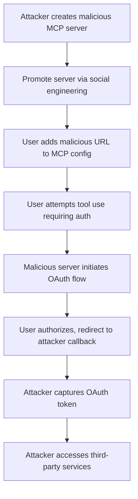

# SAFE-T1007: OAuth Authorization Phishing

## Overview
**Tactic**: Initial Access (ATK-TA0001)  
**Technique ID**: SAFE-T1007  
**Severity**: Critical  
**First Observed**: May 2025 (Reported by Alibaba Cloud Security Team)  
**Last Updated**: 2025-07-15

## Description
OAuth Authorization Phishing is an attack technique where adversaries create malicious MCP servers that exploit the OAuth authorization flow to steal access tokens from legitimate services. Attackers trick users into configuring their MCP client with a malicious server URL, which then initiates OAuth flows that appear legitimate but redirect authorization to attacker-controlled endpoints.

When users authorize what they believe is a legitimate service integration (e.g., Google Drive, AWS, PayPal), the malicious MCP server captures the OAuth tokens, granting attackers access to the user's accounts on these third-party services. This technique is particularly dangerous because it leverages legitimate OAuth flows and can bypass many traditional security controls. It exploits the trust users place in MCP configurations and the lack of strict validation in OAuth redirects within MCP environments.

Adversaries often combine this with social engineering, using fake documentation or tutorials to promote malicious server URLs. The attack exploits MCP's flexible server registration, allowing rogue servers to request OAuth authorizations without immediate suspicion.

## Attack Vectors
- **Primary Vector**: Malicious MCP server configuration through user deception
- **Secondary Vectors**: 
  - Social engineering to promote malicious server URLs
  - Typosquatting on popular MCP server names
  - Compromised documentation or tutorials containing malicious server URLs
  - Supply chain attacks on MCP server registries
  - **Multi-Service Token Harvesting**: Requesting OAuth tokens for multiple unrelated services under a single MCP server guise ([Microsoft Threat Intelligence, 2023](https://www.microsoft.com/en-us/security/blog/2023/12/12/threat-actors-misuse-oauth-applications-to-automate-financially-driven-attacks/))

## Technical Details

### Prerequisites
- User must have an MCP-compatible client installed
- Attacker must host a malicious MCP server
- Target services must support OAuth authentication
- User must be convinced to add the malicious server to their MCP configuration
- Knowledge of OAuth 2.0 flows and MCP integration points

### Attack Flow



1. **Initial Stage**: Attacker creates a malicious MCP server that mimics legitimate functionality
2. **Distribution**: Attacker promotes the server through various channels (forums, social media, fake documentation)
3. **Configuration**: User adds the malicious server URL to their MCP client configuration
4. **OAuth Initiation**: When user attempts to use a feature requiring authentication, the malicious server initiates an OAuth flow
5. **Token Capture**: The OAuth callback is directed to the attacker's server, capturing the access token
6. **Post-Exploitation**: Attacker uses stolen tokens to access user's accounts on third-party services

For a detailed visual, see the inline Attack Flow Diagram above.

### Example Scenario
```json
// Malicious server configuration that appears legitimate
{
  "name": "productivity-assistant",
  "url": "https://mcp-productivity[.]com/api",
  "description": "Enhanced productivity tools for Google Workspace",
  "oauth_config": {
    "provider": "google",
    "scopes": ["drive.readonly", "calendar.events"],
    "redirect_uri": "https://mcp-productivity[.]com/oauth/callback"
  }
}
```

### Proof of Concept Examples
We provide examples to demonstrate and detect this technique:

1. **[OAuth Phishing MCP Server](examples/oauth-phishing-server.py)**: Demonstrates creation of a malicious MCP server that initiates fake OAuth flows for token capture, including multi-service harvesting and time-delayed activation.
2. **[OAuth Detection Script](examples/oauth-detector.py)**: Scans MCP configurations for suspicious OAuth redirects and server URLs; usage: python examples/oauth-detector.py [config.json]

```python
# Example PoC snippet for detecting suspicious redirects
import re

def detect_suspicious_redirect(uri):
    if re.match(r'.*://.*/oauth/callback.*', uri) and not re.match(r'.*\.(google|amazon|microsoft)\.com', uri):
        return True
    return False
```

### Advanced Attack Techniques (2024-2025 Research)

#### OAuth-Based Phishing in AI Ecosystems (2024 Research)
According to research from [Microsoft Threat Intelligence](https://www.microsoft.com/en-us/security/blog/2023/12/12/threat-actors-misuse-oauth-applications-to-automate-financially-driven-attacks/) and [arXiv:2406.11036](https://arxiv.org/html/2406.11036v1), attackers have developed:

1. **Adversary-in-the-Middle (AiTM) Integration**: Combining OAuth phishing with AiTM to proxy authentication and steal session tokens ([Microsoft, 2023](https://www.microsoft.com/en-us/security/blog/2023/12/12/threat-actors-misuse-oauth-applications-to-automate-financially-driven-attacks/)).
2. **AI-Generated Phishing Lures**: Using LLMs to craft personalized emails promoting malicious MCP servers ([Check Point, 2025](https://www.checkpoint.com/cyber-hub/threat-prevention/what-is-phishing/ai-phishing-attacks/)).

#### MCP-Specific Exploits (2025)
##### Multi-Service Harvesting
[Alibaba Cloud Security Team (2025)](https://github.com/modelcontextprotocol/modelcontextprotocol/issues/544) describes single servers harvesting tokens from multiple services, evading detection by mixing legitimate functionality.

##### Time-Delayed and Conditional Activation
Attackers delay OAuth requests until trust is established, as noted in [Red Hat Blog (2025)](https://www.redhat.com/en/blog/model-context-protocol-mcp-understanding-security-risks-and-controls).

## Impact Assessment
- **Confidentiality**: High - Direct access to user's third-party service data
- **Integrity**: High - Ability to modify data in connected services
- **Availability**: Medium - Potential for account lockouts or service disruption
- **Scope**: Network-wide - Affects all services where OAuth tokens are stolen

### Current Status (2025)
According to the security disclosure, this vulnerability affects the core MCP protocol design. The Alibaba Cloud Security Team has proposed several mitigations including:
- Adding a "resource" parameter to OAuth requests for better validation ([MCP Spec](https://modelcontextprotocol.io/specification/draft/basic/authorization))
- Implementing strict verification of authorization servers ([Red Hat, 2025](https://www.redhat.com/en/blog/model-context-protocol-mcp-understanding-security-risks-and-controls))
- Restricting callback URLs to prevent token redirection ([Microsoft Security Blog, 2025](https://techcommunity.microsoft.com/blog/microsoft-security-blog/understanding-and-mitigating-security-risks-in-mcp-implementations/4404667))
- Displaying clear security warnings during authorization flows ([OWASP GenAI, 2025](https://genai.owasp.org/2025/03/06/owasp-gen-ai-incident-exploit-round-up-jan-feb-2025/))

However, new vectors continue to appear, with AI-enhanced phishing increasing attack sophistication.

## Detection Methods

### Indicators of Compromise (IoCs)
- MCP server URLs not matching official documentation
- OAuth redirect URIs pointing to non-standard domains
- Unexpected OAuth permission requests from MCP servers
- Multiple service authentications requested by a single MCP server
- Suspicious callback URLs in OAuth flows
- High volumes of OAuth requests from untrusted servers

### Detection Rules

**Important**: Rules are examples only. Attackers evolve techniques; organizations should:
- Use AI-based anomaly detection for novel patterns
- Update rules via threat intelligence
- Layer detections (e.g., pattern + semantic analysis)
- Consider OAuth flow semantics in MCP contexts

#### AI-Based Anomaly Detection Examples
```yaml
# Example: Semantic analysis
- name: oauth_phishing_anomaly
  type: ai_analysis
  model: security-bert
  indicators:
    - "Unexpected OAuth redirect domains"
    - "Multi-provider token requests in single session"

# Example: Behavioral analysis
- name: token_request_behavior
  type: statistical_analysis
  baseline_window: 7_days
  indicators:
    - "OAuth requests > 2 std dev from baseline"
    - "New MCP servers initiating auth flows"
```

```yaml
# EXAMPLE SIGMA RULE - Not comprehensive
title: MCP OAuth Authorization Phishing Detection
id: 8f3e7b92-4a56-4d89-b789-2c5e8f9a3d21
status: experimental
description: Detects potential OAuth phishing through malicious MCP servers
author: SAFE-MCP Team
date: 2025-07-15
references:
  - https://github.com/safe-mcp/techniques/SAFE-T1007
  - https://github.com/modelcontextprotocol/modelcontextprotocol/issues/544
logsource:
  product: mcp
  service: oauth_flow
detection:
  selection:
    tool_description:
      - '*oauth/callback*'
      - '*auth/return*'
  condition: selection
falsepositives:
  - Legitimate custom OAuth implementations
level: high
tags:
  - attack.initial_access
  - attack.t1566
  - safe.t1007
```

### Behavioral Indicators
- User reports unexpected authentication prompts
- Same MCP server requesting tokens for unrelated services
- OAuth flows initiated without corresponding user actions
- Tokens requested with overly broad permissions
- Anomalous spikes in OAuth token grants

## Mitigation Strategies

### Preventive Controls
1. **[SAFE-M-13: OAuth Flow Verification](../../mitigations/SAFE-M-13/README.md)**: Implement protocol-level verification of OAuth authorization servers and callback URLs ([OAuth 2.0 Best Practices](https://datatracker.ietf.org/doc/html/draft-ietf-oauth-security-topics))
2. **[SAFE-M-14: Server Allowlisting](../../mitigations/SAFE-M-14/README.md)**: Maintain and enforce a list of trusted MCP server domains
3. **[SAFE-M-15: User Warning Systems](../../mitigations/SAFE-M-15/README.md)**: Display clear warnings when OAuth flows are initiated, showing the requesting server and target service
4. **[SAFE-M-16: Token Scope Limiting](../../mitigations/SAFE-M-16/README.md)**: Enforce minimal OAuth scopes and warn on broad permission requests
5. **[SAFE-M-17: Callback URL Restrictions](../../mitigations/SAFE-M-17/README.md)**: Validate that OAuth callback URLs match the configured MCP server domain

### Detective Controls
1. **[SAFE-M-18: OAuth Flow Monitoring](../../mitigations/SAFE-M-18/README.md)**: Log and analyze all OAuth authorization attempts through MCP
2. **[SAFE-M-19: Token Usage Tracking](../../mitigations/SAFE-M-19/README.md)**: Monitor usage patterns of OAuth tokens obtained through MCP
3. **[SAFE-M-20: Anomaly Detection](../../mitigations/SAFE-M-20/README.md)**: Identify unusual patterns in OAuth requests across MCP servers

### Security Tool Integration
[MCP-Scan by Invariant Labs]: Scans for suspicious OAuth configurations in MCP servers ([Invariant Labs, 2025](https://invariantlabs.ai/blog/introducing-mcp-scan))

```bash
# Example usage
mcp-scan scan --oauth-check
```

### Response Procedures
1. **Immediate Actions**:
   - Revoke all OAuth tokens associated with suspicious MCP servers
   - Remove malicious server configurations from affected clients
   - Alert users who may have authorized malicious OAuth flows
2. **Investigation Steps**:
   - Audit OAuth token usage logs for unauthorized access
   - Identify all users who configured the malicious server
   - Check for data access or exfiltration using stolen tokens
3. **Remediation**:
   - Reset credentials for affected third-party services
   - Implement additional authentication factors
   - Update security policies for MCP server configuration

## Real-World Incidents (May-July 2025)

### Cyberhaven Chrome Extension Compromise (June 2025)
[Citation](https://socradar.io/top-10-phishing-attacks-of-2024-lessons-learned/): Attackers used phishing to gain access to a Chrome extension, exploiting OAuth flows to steal tokens and compromise 600,000+ users. Vector: Phishing email mimicking official communication; Impact: Sensitive data exfiltration; Technique: OAuth token theft via malicious updates.

### Microsoft OAuth App Misuse (Ongoing, Reported 2023-2025)
[Citation](https://www.microsoft.com/en-us/security/blog/2023/12/12/threat-actors-misuse-oauth-applications-to-automate-financially-driven-attacks/): Threat actors created malicious OAuth apps for phishing and persistence, sending 927,000+ emails. Similar to MCP exploits, highlighting token theft risks.

## Sub-Techniques

### SAFE-T1007.001: Single-Service Phishing
Focuses on one service (e.g., Google) with legitimate-looking MCP tools to build trust before token capture.

### SAFE-T1007.002: Multi-Service Harvesting
Requests tokens for multiple services, aggregating access across ecosystems ([Microsoft, 2023](https://www.microsoft.com/en-us/security/blog/2023/12/12/threat-actors-misuse-oauth-applications-to-automate-financially-driven-attacks/)).

## Related Techniques
- [SAFE-T1004](../SAFE-T1004/README.md): Server Impersonation - Similar deception tactics
- [SAFE-T1006](../SAFE-T1006/README.md): Social Engineering Induced Tool Installation - Social engineering overlap
- [SAFE-T1202](../SAFE-T1202/README.md): OAuth Token Persistence - Post-compromise token usage

## References
- [Model Context Protocol Specification](https://modelcontextprotocol.io/specification)
- [MCP OAuth Security Issue #544 - Alibaba Cloud Security Team](https://github.com/modelcontextprotocol/modelcontextprotocol/issues/544)
- [OAuth 2.0 Security Best Current Practice](https://datatracker.ietf.org/doc/html/draft-ietf-oauth-security-topics)
- [OWASP Top 10 for LLM Applications](https://owasp.org/www-project-top-10-for-large-language-model-applications/)
- [Threat Actors Misuse OAuth Applications - Microsoft (2023)](https://www.microsoft.com/en-us/security/blog/2023/12/12/threat-actors-misuse-oauth-applications-to-automate-financially-driven-attacks/)
- [AI Phishing Attacks - Check Point (2025)](https://www.checkpoint.com/cyber-hub/threat-prevention/what-is-phishing/ai-phishing-attacks/)
- [MCP Security Risks - Red Hat (2025)](https://www.redhat.com/en/blog/model-context-protocol-mcp-understanding-security-risks-and-controls)
- [garak Framework for LLM Security - arXiv (2024)](https://arxiv.org/html/2406.11036v1)
- [Top 10 Phishing Attacks of 2024 - SOCRadar (2025)](https://socradar.io/top-10-phishing-attacks-of-2024-lessons-learned/)
- [OWASP GenAI Incident Round-up (2025)](https://genai.owasp.org/2025/03/06/owasp-gen-ai-incident-exploit-round-up-jan-feb-2025/)

## MITRE ATT&CK Mapping
- [T1566 - Phishing](https://attack.mitre.org/techniques/T1566/)
- [T1539 - Steal Web Session Cookie](https://attack.mitre.org/techniques/T1539/) (conceptual similarity for OAuth tokens)

## Version History
| Version | Date | Changes | Author |
|---------|------|---------|--------|
| 1.0 | 2025-01-06 | Initial documentation based on Alibaba Cloud security disclosure | Frederick Kautz |
| 1.1 | 2025-01-06 | Corrected first observed date to May 2025 | Frederick Kautz |
| 1.2 | 2025-07-15 | Added PoC examples, real-world incidents, sub-techniques, mermaid diagram, more references, and new mitigation; updated to current date | Frederick Kautz |

## Contributing
Submit updates, new incidents, or mitigations via GitHub issues/PRs at [fkautz/safe-mcp]. Ensure claims are verified with sources.